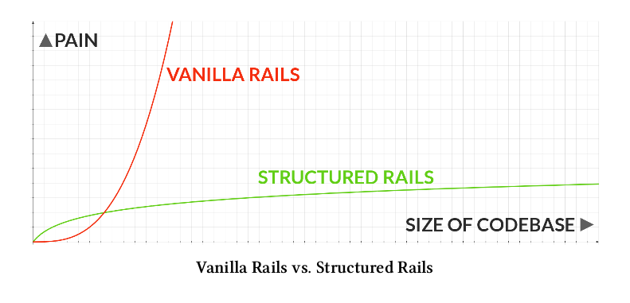

## Por qué preocuparse por la calidad de código?

1. Somos mejores programadores
2. Podemos reutilizar código
3. Generamos código más fácil de entender para los demas y para nosotros mismos
4. Somos más felices
5. Nos permite liberar código open source

## Codigo bien estructurado VS código mal estructurado



## Antes de empezar...

## Tips para Javascript

## Algo que todos debemos de saber del lenguaje es que tiene partes muy muy malas
```javascript
  var a = '1'
  var b = 1

  a == b
  a === b
```

## Module Pattern
El module pattern define una forma para definir modulos usando IIFE


Immediately-Invoked Function Expression


Son funciones que se mandan a llamar cuando se definen:

```javascript
  #basic structure
  (function(){ /* code */ }());

  var SampleModule = (function(){
    'use strict';
    var my_fucking_private_function = function () {
      return 'private method';
    }

    var my_fucking_public_function = function () {
      return 'public method';
    }

    return
    {
      public_function: my_fucking_public_function
    }
   }());

#trying to call module function


SampleModule.public_function()
```

#### Llaves a la derecha o a la izquierda?
```javascript
  var return_json = function () {
    return
    {

    }
  }
```

### Ahora sí deberia de funcionar :D
```javascript
  #basic structure
  (function(){ /* code */ }());

  var SampleModule = (function(){
    'use strict';
    var my_fucking_private_function = function () {
      return 'private method';
    }

    var my_fucking_public_function = function () {
      return 'public method';
    }

    return
    {
      public_function: my_fucking_public_function
    }
   }());

#trying to call module function

SampleModule.public_function()

```

# Principios de Codigo Limpio

## DRY
Dont Repeat Yourself

Cuando lo usas? Siempre!

## KISS

Keep It Simple, Stupid!

Cuando lo usas? Siempre!

# En programación orientada a objetos
## SOLID
### Single Responsibility
A class should have only a single responsibility (i.e. only one potential change in the software's specification should be able to affect the specification of the class)
```ruby
class DealProcessor
  def initialize(deals)
    @deals = deals
  end

  def process
    @deals.each do |deal|
      Commission.create(deal: deal, amount: calculate_commission)
      mark_deal_processed
    end
  end

  private

  def mark_deal_processed
    @deal.processed = true
    @deal.save!
  end

  def calculate_commission
    @deal.dollar_amount * 0.05
  end
end
```


### Open-Closed
“software entities … should be open for extension, but closed for modification.”

```ruby
class UsageFileParser
  def initialize(client, usage_file)
    @client = client
    @usage_file = usage_file
  end

  def parse
    case @client.usage_file_format
      when :xml
        parse_xml
      when :csv
        parse_csv
    end

    @client.last_parse = Time.now
    @client.save!
  end

  private

  def parse_xml
    # parse xml
  end

  def parse_csv
    # parse csv
  end
end
```

```ruby
class UsageFileParser
  def initialize(client, parser)
    @client = client
    @parser = parser
  end

  def parse(usage_file)
    parser.parse(usage_file)
    @client.last_parse = Time.now
    @client.save!
  end
end

class XmlParser
  def parse(usage_file)
    # parse xml
  end
end

class CsvParser
  def parse(usage_file)
    # parse csv
  end
end
```
### Liskov Substitution
“objects in a program should be replaceable with instances of their subtypes without altering the correctness of that program.” See also design by contract.

una violacion de este principio
```ruby
class Rectangle
  def set_height(height)
    @height = height
  end

  def set_width(width)
    @width = width
  end
end

class Square < Rectangle
  def set_height(height)
    super(height)
    @width = height
  end

  def set_width(width)
    super(width)
    @height = width
  end
end
```
### Interface Segregation
“many client-specific interfaces are better than one general-purpose interface.”

### Dependency Inversion
one should “Depend upon Abstractions. Do not depend upon concretions.”
high-level (think business logic) objects not depending on low-level (think database querying and IO) implementation details

```ruby
class UsageFileParser
  def initialize(client, parser)
    @client = client
    @parser = parser
  end

  def parse(usage_file)
    parser.parse(usage_file)
    @client.last_parse = Time.now
    @client.save!
  end
end

class XmlParser
  def parse(usage_file)
    # parse xml
  end
end

class CsvParser
  def parse(usage_file)
    # parse csv
  end
end

```

ejemplps extraídos de https://robots.thoughtbot.com/back-to-basics-solid

# Lo que siempre debes de hacer

1. Usar un sistema de control de versiones
2. Usar testing
3. Replantear el código que acabas de terminar
4. Refactor
5. No re-inventar la rueda, entender cómo rueda
6. Contribuir al open source <3


# Cómo convencer a tu jefe?

## No lo hagas!


# Agradecemos por las chelas

www.tegik.com


